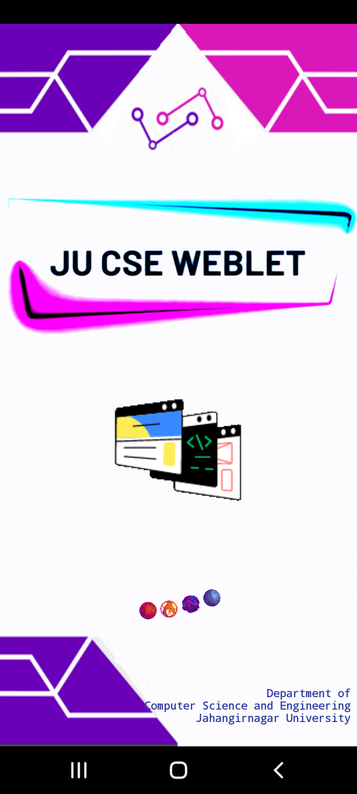
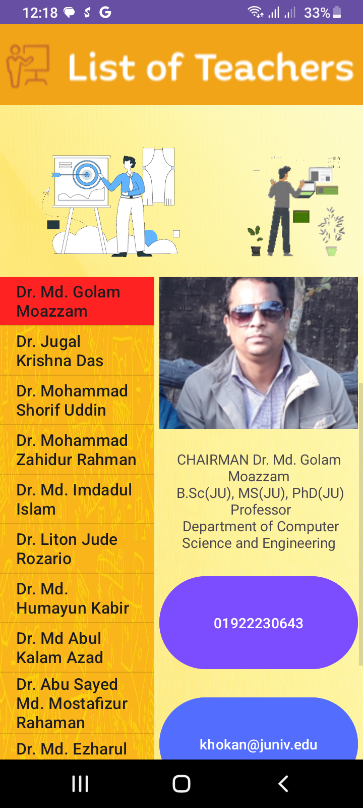
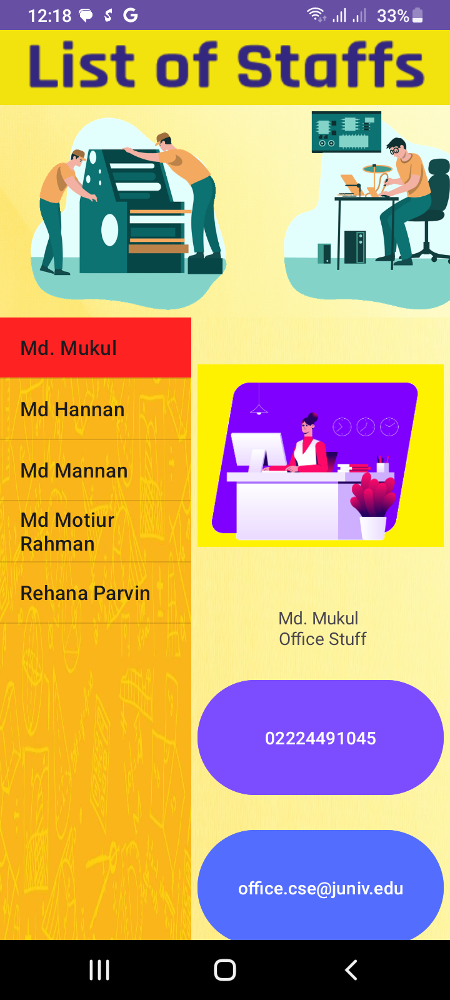

# JU CSE WEBLET 📱

A modern, user-friendly Android app designed for students of the **Department of Computer Science and Engineering (CSE)** at **Jahangirnagar University**. WEBLET provides easy access to essential university resources, lecture notes, announcements, and more—all in one place.

## Features 🌟
- **Course Materials:** View and download lecture notes, assignments, and other academic resources for each course.
- **Announcements:** Get instant updates on department news and announcements.
- **Timetable:** Keep track of your class schedule and important events.
- **Student Information:** View your academic profile and course-related information.
- **Direct Contact:** Call or email your teachers and staff members directly from the app.
- **Department Achievement Gallery:** Explore the department's achievements, awards, and special events in a dedicated gallery.
- **Group Chat:** Participate in group chats for course-related discussions and student collaborations.
- **User-Friendly Interface:** Simple, intuitive, and visually appealing design for smooth navigation.

## Firebase Integration 🔥

Firebase plays a critical role in the **JU CSE WEBLET** app, enabling several key features:

- **Real-Time Notifications:** Firebase Cloud Messaging (FCM) sends instant notifications to users about new announcements, updates, or changes.
- **User Authentication:** Firebase Authentication is used to manage user login and ensure secure access to the app.
- **Database Management:** Firebase Firestore stores dynamic data such as announcements, course details, and student information, allowing real-time updates.
- **Group Chats:** Firebase Realtime Database supports group chat functionality, enabling students and faculty to interact and collaborate efficiently.
- **Analytics:** Firebase Analytics tracks user interactions within the app, providing insights to improve functionality and user experience.

## App Workflow 🔄

1. **User Login:** Upon starting the app, users are required to log in with their university credentials.
2. **Dashboard:** After login, users are presented with a dashboard showing their courses, announcements, and other information.
3. **Access Resources:** Students can navigate through the app to download course materials, view timetables, and stay updated with university news.
4. **Notifications:** Firebase notifications are used to keep users informed of any new announcements or updates from the department.


## Screenshots 📸

<div align="center">
  
  
  
  
  
  
  
  
  
  
  
  
  
  
  
   
  
  
</div>


## Installation 🔧

To set up the **JU CSE WEBLET** app locally, follow these steps:

1. **Clone the repository:**
   ```bash
   git clone https://github.com/Amai-Mask/ju-cse-weblet.git

## Conclusion 🎉

The **JU CSE WEBLET** app provides an efficient and user-friendly platform for students and faculty of the **Department of Computer Science and Engineering** at **Jahangirnagar University**. With features like easy access to course materials, real-time notifications, group chats, and direct contact with faculty, it aims to streamline academic and departmental communication. Firebase integration ensures seamless real-time updates and robust user experience, making this app an essential tool for academic engagement and collaboration.

